# ADIN2111 Driver Theory of Operation

## Table of Contents
1. [Overview](#overview)
2. [Hardware Architecture](#hardware-architecture)
3. [Driver Architecture](#driver-architecture)
4. [SPI Communication Protocol](#spi-communication-protocol)
5. [Operating Modes](#operating-modes)
6. [Data Flow](#data-flow)
7. [Initialization Sequence](#initialization-sequence)
8. [Packet Transmission](#packet-transmission)
9. [Packet Reception](#packet-reception)
10. [MAC Learning and Forwarding](#mac-learning-and-forwarding)
11. [Interrupt Handling](#interrupt-handling)
12. [Link Management](#link-management)

## Overview

The ADIN2111 is a dual-port 10BASE-T1L Ethernet switch with an SPI host interface. This driver implements a Linux network driver that can operate the device in two modes:
- **Dual Interface Mode**: Each port appears as a separate network interface (eth0, eth1)
- **Single Interface Mode**: Both ports operate as a unified switch with one network interface

## Hardware Architecture

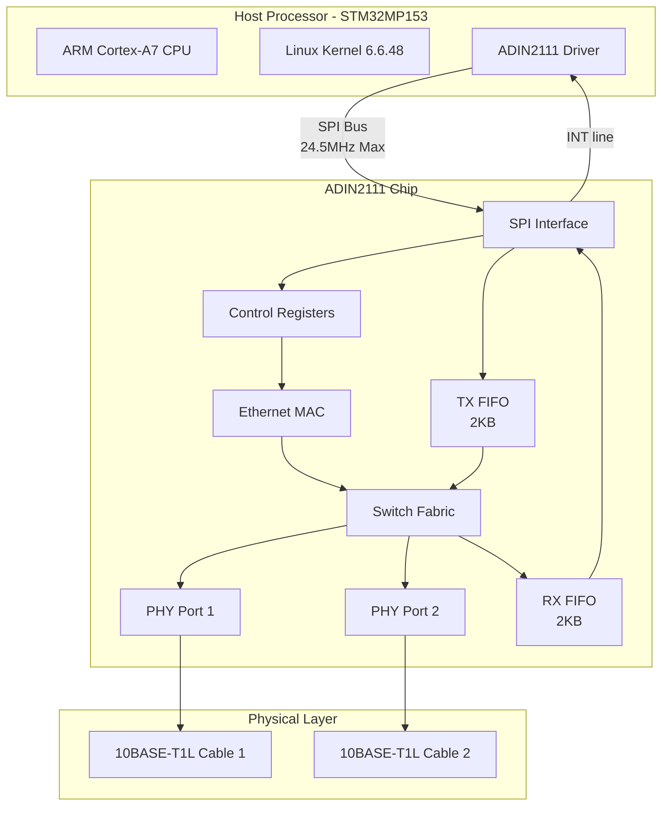

### Key Hardware Components

| Component | Description | Details |
|-----------|-------------|---------|
| SPI Interface | Host communication | Up to 24.5 MHz, supports optional CRC |
| TX FIFO | Transmit buffer | 2KB, register 0x31 |
| RX FIFO | Receive buffer | 2KB, register 0x91 |
| Switch Fabric | L2 switching logic | Hardware cut-through forwarding |
| PHY Ports | Physical layer interfaces | 10BASE-T1L, up to 1700m reach |
| MAC Table | Address learning | 256 entries, 5-minute aging |

## Driver Architecture

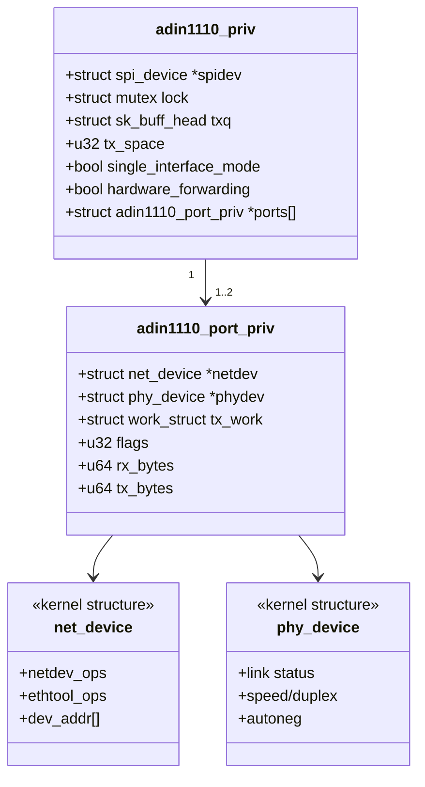

## SPI Communication Protocol

The ADIN2111 uses a specific SPI protocol format:

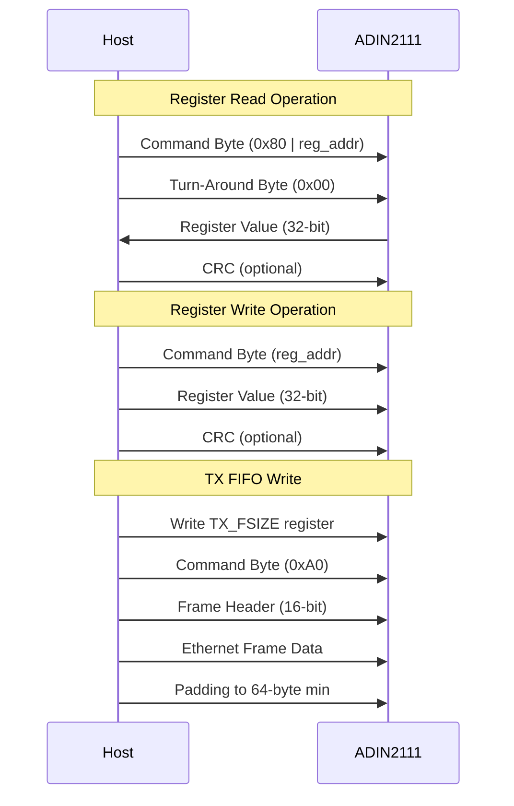

### SPI Transaction Format

| Field | Size | Description |
|-------|------|-------------|
| Command Byte | 1 byte | Bit 7: R/W, Bits 6-0: Address |
| Turn-Around | 1 byte | Only for reads (0x00) |
| Data | 4 bytes | Register value (BE) |
| CRC | 1 byte | Optional, if enabled |

## Operating Modes

### Dual Interface Mode (Default)

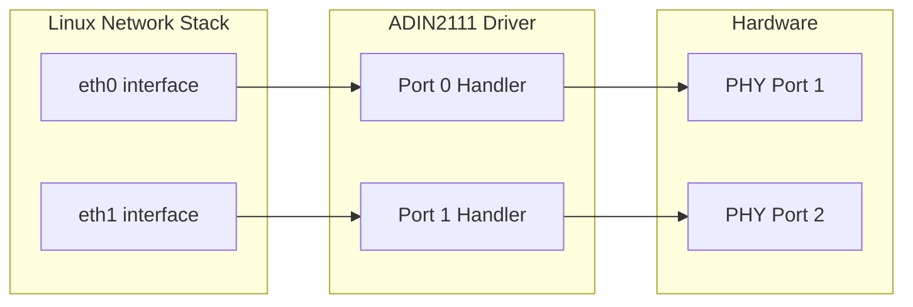

### Single Interface Mode

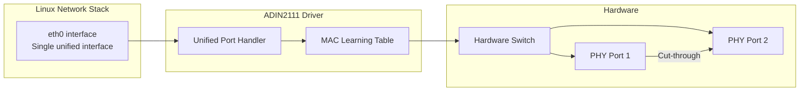

## Data Flow

### Overall Packet Flow


## Initialization Sequence

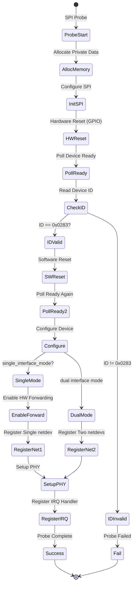

### Device Ready Polling Algorithm

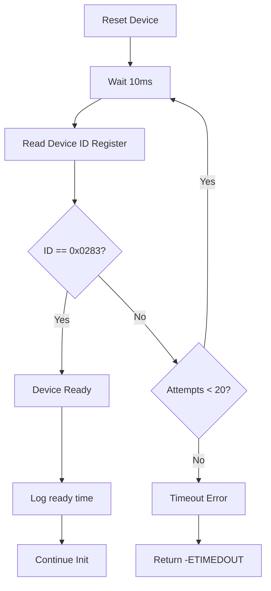

## Packet Transmission

### TX Path in Single Interface Mode

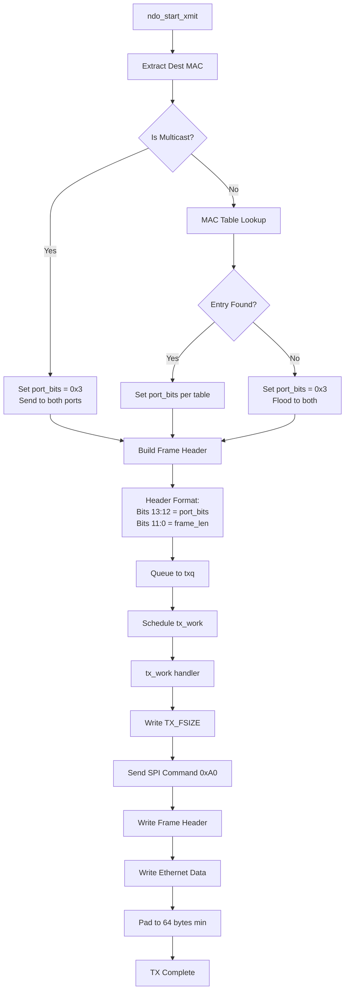

### Frame Header Format

```
Bit Position:  15  14  13  12  11  10  9  8  7  6  5  4  3  2  1  0
              +---+---+---+---+---+---+---+---+---+---+---+---+---+---+---+---+
Frame Header: | 0 | 0 | P1| P0|            Frame Length (bytes)              |
              +---+---+---+---+---+---+---+---+---+---+---+---+---+---+---+---+

P1:P0 Port Selection:
- 00: No ports (invalid)
- 01: Port 1 only
- 10: Port 2 only  
- 11: Both ports (flooding/multicast)
```

## Packet Reception

### RX Interrupt Flow

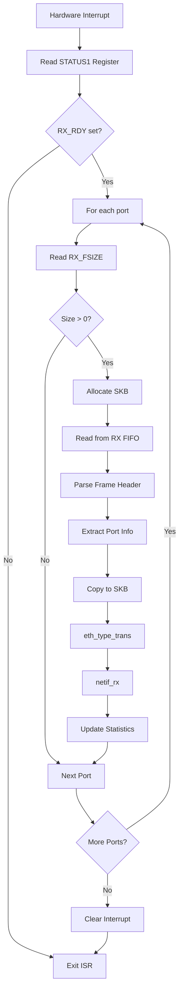

## MAC Learning and Forwarding

### MAC Learning Table Implementation

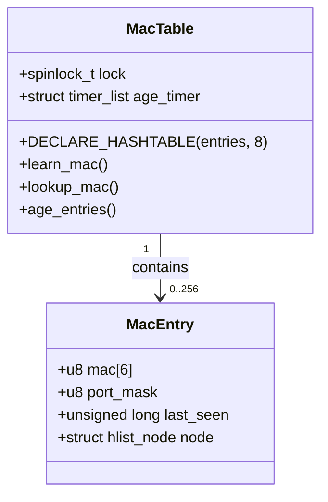

### MAC Learning Algorithm

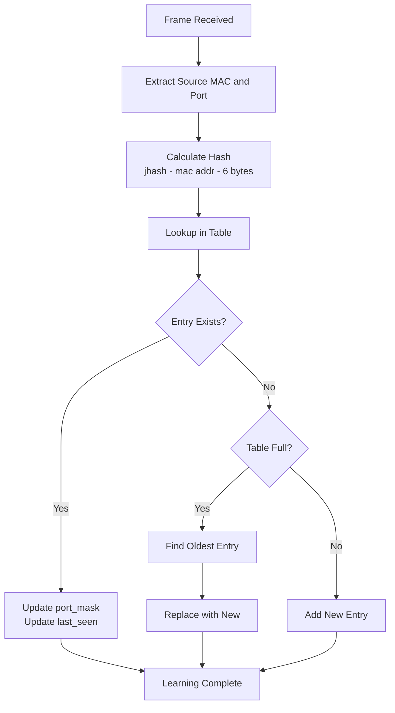

### Forwarding Decision

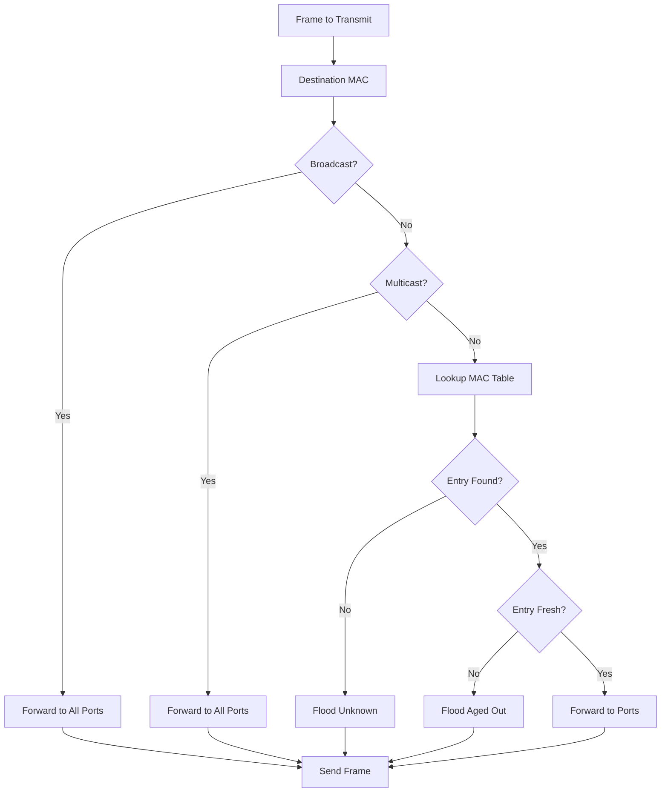

## Interrupt Handling

### Interrupt Sources and Processing

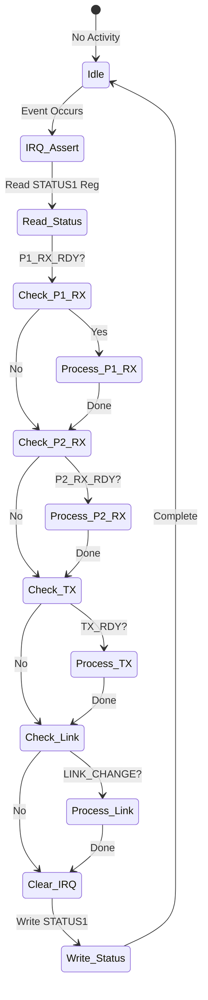

### Interrupt Status Register (STATUS1)

| Bit | Name | Description |
|-----|------|-------------|
| 0 | P1_RX_RDY | Port 1 RX FIFO has data |
| 1 | P2_RX_RDY | Port 2 RX FIFO has data |
| 2 | TX_RDY | TX FIFO space available |
| 3 | LINK_CHANGE | PHY link status changed |
| 4 | P1_PHYINT | Port 1 PHY interrupt |
| 5 | P2_PHYINT | Port 2 PHY interrupt |
| 6 | TX_ERR | Transmit error occurred |
| 7 | RX_ERR | Receive error occurred |

## Link Management

### PHY Link State Machine

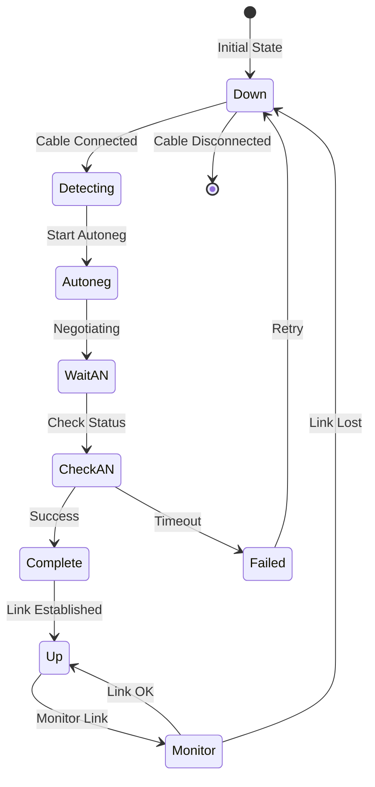

### Link Status Processing

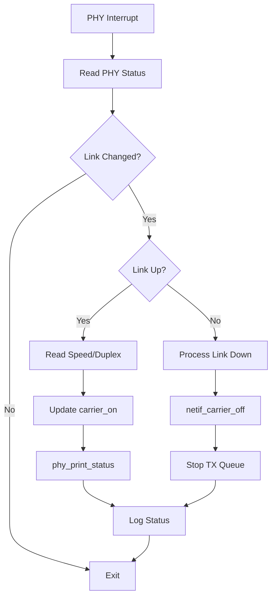

## Performance Optimizations

### Hardware Cut-Through Forwarding

When enabled in single interface mode, the ADIN2111 can forward frames between ports without CPU intervention:

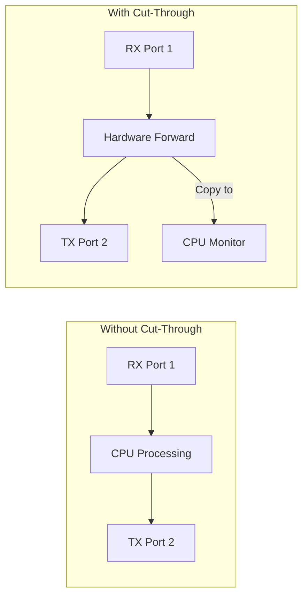

### TX Queue Management

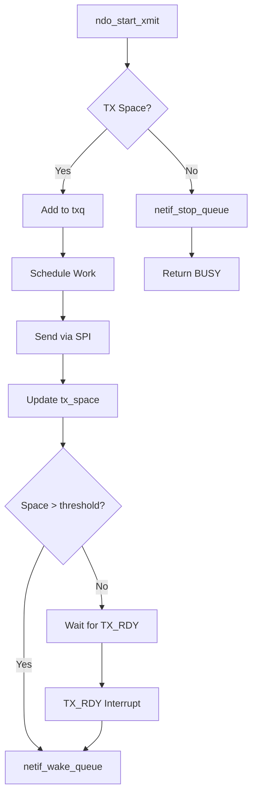

## Error Handling

### Error Recovery State Machine

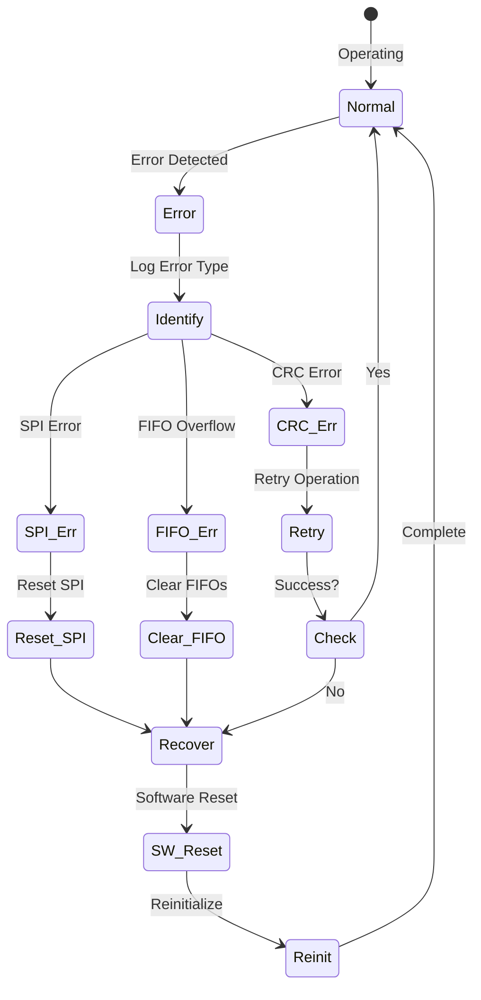

## Module Parameters

### Configuration Flow

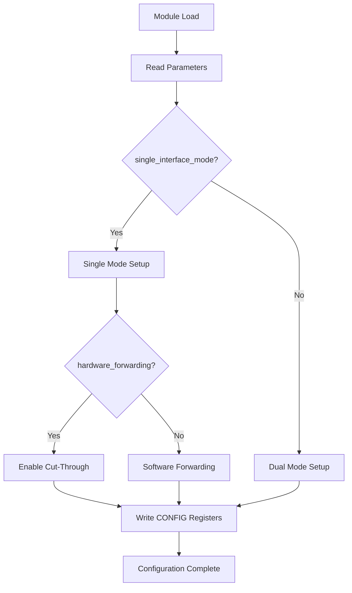

## Summary

The ADIN2111 driver implements a complete Linux network driver for a dual-port 10BASE-T1L Ethernet switch. Key features include:

1. **Flexible Operation**: Supports both dual interface and single interface modes
2. **Hardware Acceleration**: Leverages hardware cut-through forwarding
3. **Robust Communication**: Implements proper SPI protocol with CRC support
4. **Intelligent Reset**: Polls for device readiness instead of fixed delays
5. **MAC Learning**: Software-based MAC table for intelligent forwarding
6. **Error Recovery**: Comprehensive error handling and recovery mechanisms
7. **Performance Optimized**: Minimizes CPU overhead through hardware features

The driver bridges the gap between the Linux network stack and the ADIN2111 hardware, providing a reliable and efficient networking solution for industrial and automotive applications requiring long-reach Ethernet connectivity.

---
*Theory of Operation v1.0 - August 2025*  
*Authors: Alexandru Tachici (ADI), Murray Kopit*